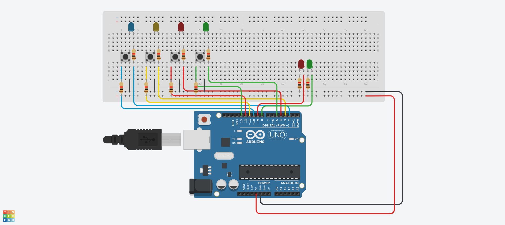

# Simas mandou

Projeto de Arduino para a disciplina de eletrônica para computação

| Apresentação do Arduino |
| --- |
| <video src="https://user-images.githubusercontent.com/52839749/179527939-c2d2ede8-3dbf-4e9b-895d-d80d98d2e676.mp4" style="max-width: 730px;"></video> |
## Explicações
O trabalho em tecnologia Arduino adotado foi o projeto de um jogo no modelo "Simon Says", apelidado de Simas Mandou. Em síntese, o jogo consiste na geração aleatória de um padrão no acendimento dos quatro(azul, amarelo, vermelho e verde) LEDs sinalizadores que deve ser seguido pela sequência de inputs do jogador(nos respectivos botões de cada cor), a cada acerto a sequência aumenta em um. Caso algum erro seja identificado na entrada do jogador, um rápido acendimento do LED vermelho de resposta é exibido, em contraste com a ação do LED verde que sinaliza o acerto do jogador. Em detalhes, o jogo apresenta uma sequência limite de 100 elementos em que a velocidade no acendimento dos LEDs é incrementada após cada acerto, de modo que a dificuldade aumente continuamente. Em relação aos componentes eletrônicos, foram utilizados na implementação: 6 diodos do tipo LED(5 MM), 4 botões do tipo tower e 6 resistores de 1k(utilizados principalmente para evitar o desperdício de corrente elétrica).

